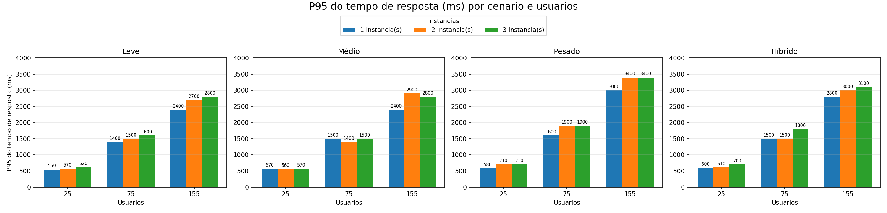
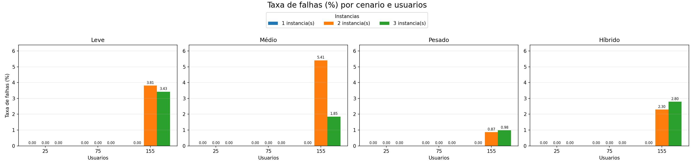
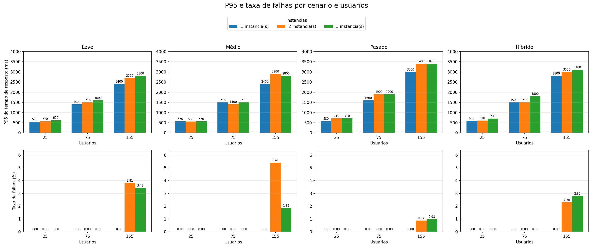
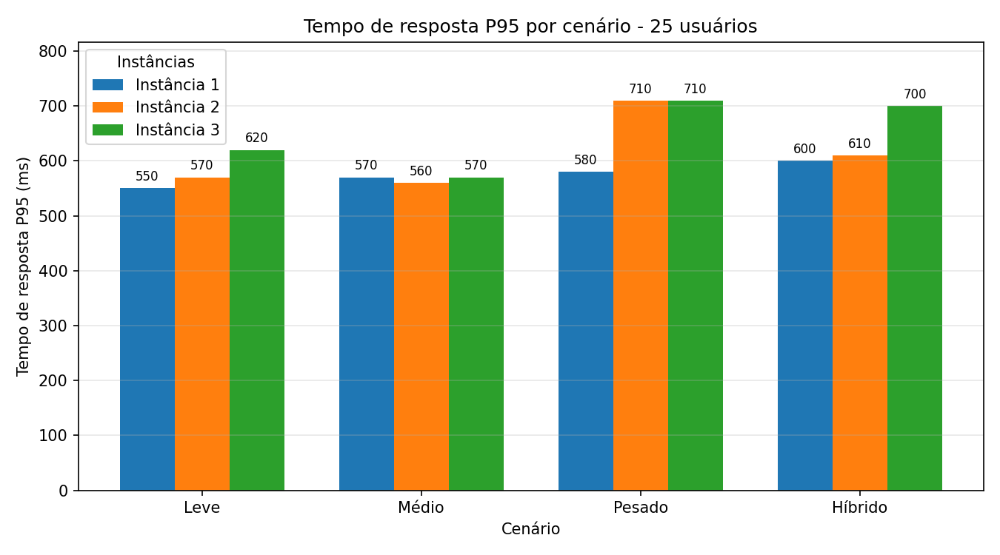
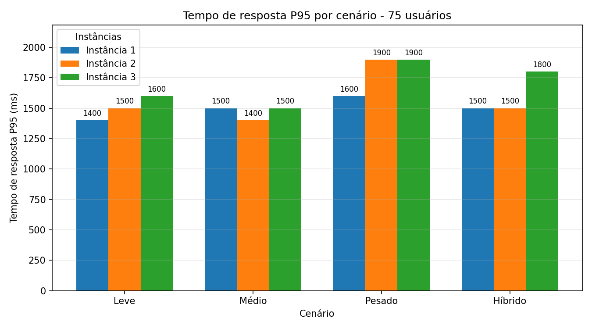
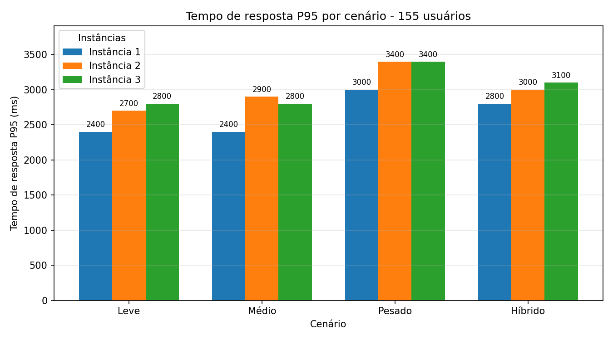
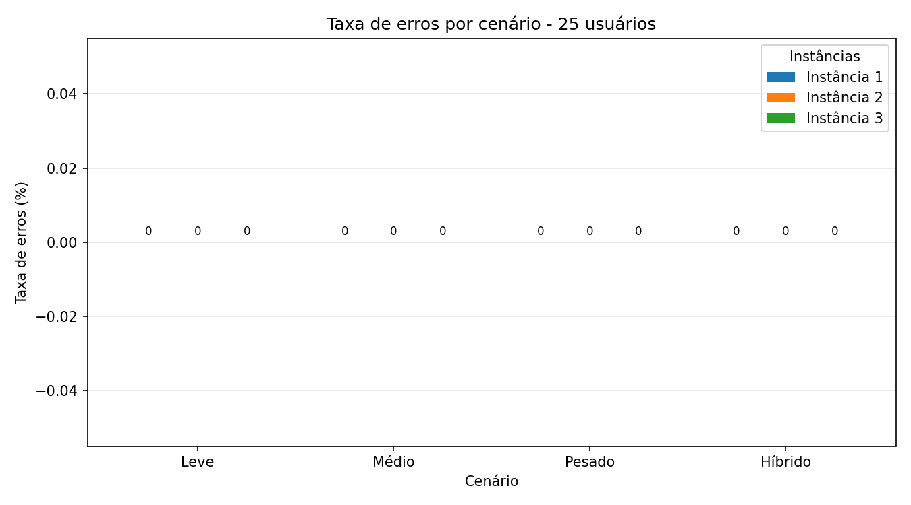
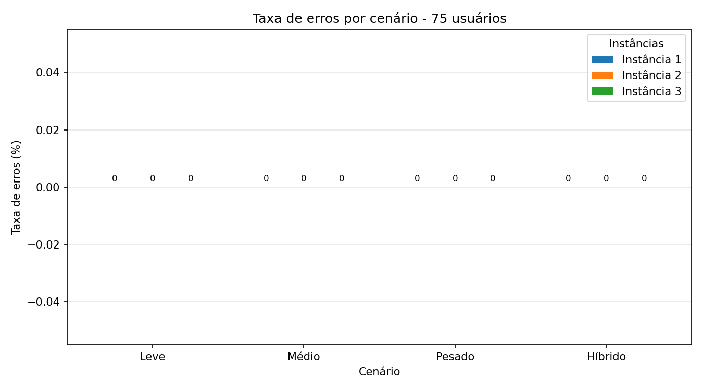
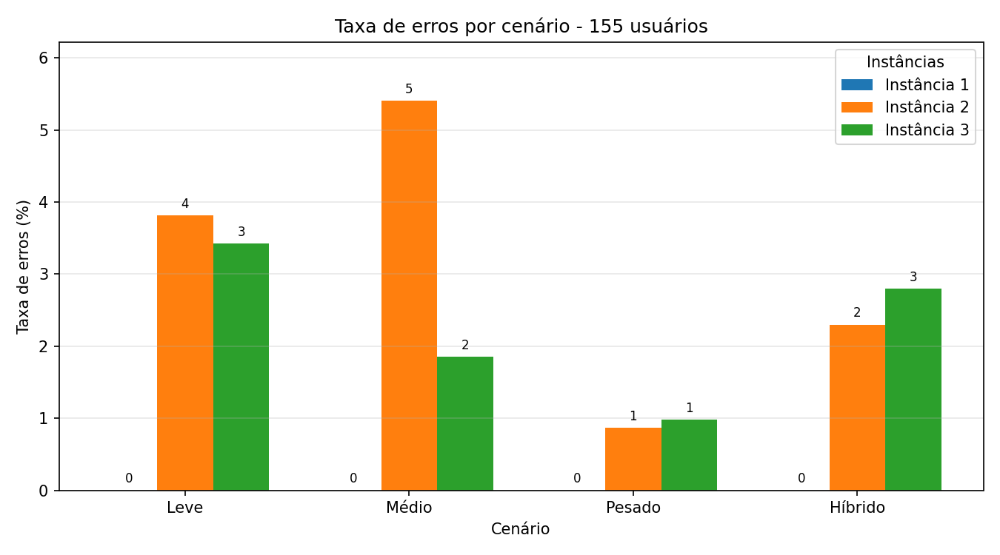

# Trabalho 3: Testes de Carga com WordPress, Locust e Múltiplas Instâncias

## Resumo

Este projeto realiza testes de carga em uma aplicação WordPress executada em contêineres Docker, com o objetivo de avaliar o comportamento do sistema quando submetido a diferentes quantidades de usuários simultâneos e a diferentes números de instâncias da aplicação.

A arquitetura utiliza o Locust para geração de carga, o Nginx como balanceador de carga, múltiplas instâncias do WordPress como aplicação testada e um banco de dados MySQL compartilhado. Os resultados coletados pelo Locust são consolidados em um arquivo CSV e posteriormente visualizados por meio de gráficos de desempenho.

O estudo busca observar como o aumento horizontal da aplicação, por meio da adição de instâncias WordPress, influencia métricas como tempo de resposta P95 e taxa de falhas.

## Objetivos

O objetivo geral do trabalho é realizar testes de carga em um ambiente com múltiplas instâncias do WordPress, utilizando o Locust para simular usuários concorrentes.

Os objetivos específicos são:

- configurar um ambiente distribuído com Docker Compose;
- executar o WordPress com uma, duas e três instâncias;
- utilizar o Nginx para balancear as requisições entre as instâncias disponíveis;
- simular diferentes cargas de usuários com o Locust;
- coletar métricas de desempenho geradas automaticamente pelo Locust;
- consolidar os resultados em um arquivo único;
- gerar gráficos comparativos para apoiar a análise dos resultados.

## Ambiente de Teste

Os testes foram planejados para execução em um notebook com as seguintes características:

| Recurso             | Especificação        |
| ------------------- | -------------------- |
| Processador         | Intel Core i5-1135G7 |
| Memória RAM         | 16 GB DDR4 3200 MHz  |
| Armazenamento       | SSD 256 GB           |
| Sistema operacional | Windows 11           |

O ambiente foi conteinerizado com Docker, permitindo que os serviços fossem iniciados, interrompidos e reconfigurados de forma reproduzível durante os experimentos.

## Arquitetura da Solução

A arquitetura utilizada é composta pelos seguintes componentes:

- **Locust:** ferramenta responsável por gerar carga HTTP contra a aplicação.
- **Nginx:** servidor utilizado como balanceador de carga.
- **WordPress:** aplicação web testada, executada em até três instâncias.
- **MySQL:** banco de dados compartilhado pelas instâncias do WordPress.
- **Docker Compose:** ferramenta usada para orquestrar os contêineres.
- **Python:** utilizado para consolidação dos resultados e geração dos gráficos.

Fluxo simplificado das requisições:

```text
Locust
  ↓
Nginx
  ↓
WordPress 1, WordPress 2, WordPress 3
  ↓
MySQL
```

O arquivo `docker-compose.yml` define os serviços `mysql`, `wordpress1`, `wordpress2`, `wordpress3`, `nginx` e `locust`. O banco MySQL é compartilhado por todas as instâncias WordPress, enquanto o Nginx recebe as requisições externas e as distribui entre as instâncias ativas.

## Configuração das Instâncias

Os testes consideram três configurações de escalabilidade horizontal:

| Configuração | Instâncias WordPress ativas              |
| ------------ | ---------------------------------------- |
| 1 instância  | `wordpress1`                             |
| 2 instâncias | `wordpress1`, `wordpress2`               |
| 3 instâncias | `wordpress1`, `wordpress2`, `wordpress3` |

Para cada configuração, o script de execução copia o arquivo de configuração correspondente do Nginx:

```text
nginx/nginx-1.conf
nginx/nginx-2.conf
nginx/nginx-3.conf
```

Dessa forma, o balanceador passa a encaminhar requisições apenas para as instâncias WordPress que fazem parte do teste atual.

## Cenários de Teste

Foram definidos quatro cenários de carga, representando diferentes tipos de conteúdo acessados no WordPress.

| Cenário | Arquivo Locust     | Requisição executada         | Descrição                                            |
| ------- | ------------------ | ---------------------------- | ---------------------------------------------------- |
| Leve    | `locust_light.py`  | `/?name=post-300kb`          | Acesso a uma postagem de aproximadamente 300 KB      |
| Médio   | `locust_medium.py` | `/?name=post-400kb`          | Acesso a uma postagem de aproximadamente 400 KB      |
| Pesado  | `locust_heavy.py`  | `/?name=post-1mb`            | Acesso a uma postagem de aproximadamente 1 MB        |
| Híbrido | `locust_hybrid.py` | três requisições sequenciais | Execução combinada dos cenários leve, médio e pesado |

O cenário híbrido representa uma carga mais variada, pois um mesmo usuário virtual acessa, em sequência, os três tipos de postagem.

## Parâmetros dos Experimentos

Os experimentos variam a quantidade de usuários simultâneos e a quantidade de instâncias WordPress.

Quantidade de usuários:

```text
25, 75 e 155 usuários
```

Esses valores de carga foram escolhidos por ficarem dentro de uma taxa de erros de até 10% no ambiente de teste descrito neste trabalho.

Quantidade de instâncias:

```text
1, 2 e 3 instâncias
```

Parâmetros do Locust:

```text
spawn_rate = 3
run_time = 2m
```

Assim, cada cenário é executado combinando:

- quatro tipos de carga: leve, médio, pesado e híbrido;
- três quantidades de usuários;
- três quantidades de instâncias WordPress.

## Execução dos Testes

Antes da execução, é necessário ter Docker e Docker Compose disponíveis no ambiente.

Para iniciar o processo automatizado no Windows PowerShell:

```powershell
powershell -ExecutionPolicy Bypass -File .\run_benchmarks_4tests.ps1
```

O script `run_benchmarks_4tests.ps1` executa o seguinte fluxo:

1. cria a pasta `results/`, caso ela ainda não exista;
2. seleciona a configuração do Nginx conforme a quantidade de instâncias;
3. reinicia o ambiente Docker;
4. sobe o MySQL e as instâncias WordPress necessárias;
5. inicia o Nginx;
6. executa o Locust em modo headless para cada cenário e quantidade de usuários;
7. salva os arquivos CSV gerados pelo Locust na pasta `results/`.

Os arquivos de resultado seguem o padrão:

```text
results/<cenario>_<instancias>wp_<usuarios>users_stats.csv
```

Exemplo:

```text
results/light_2wp_75users_stats.csv
```

## Consolidação dos Resultados

Após a execução dos testes, os arquivos CSV individuais são consolidados pelo script:

```bash
python consolidate_results.py
```

Esse script lê os arquivos da pasta `results/`, extrai a linha agregada do Locust e gera o arquivo:

```text
consolidated/resultados_consolidados.csv
```

O arquivo consolidado contém, entre outras, as seguintes colunas:

| Coluna               | Significado                        |
| -------------------- | ---------------------------------- |
| `scenario`           | cenário executado                  |
| `instances`          | quantidade de instâncias WordPress |
| `users`              | quantidade de usuários simulados   |
| `requests`           | total de requisições               |
| `failures`           | total de falhas                    |
| `avg_response_ms`    | tempo médio de resposta            |
| `median_response_ms` | mediana do tempo de resposta       |
| `p95_response_ms`    | percentil 95 do tempo de resposta  |
| `p99_response_ms`    | percentil 99 do tempo de resposta  |
| `rps`                | requisições por segundo            |

## Métricas Analisadas

As principais métricas utilizadas na análise são:

- **P95 do tempo de resposta:** indica o tempo abaixo do qual 95% das requisições foram respondidas. Essa métrica é útil porque reduz a influência de casos extremos isolados e mostra uma visão mais realista da experiência da maior parte dos usuários.
- **Taxa de falhas:** representa a proporção de requisições que falharam durante o teste.

A taxa de falhas é calculada pelos scripts de gráficos da seguinte forma:

```text
(failures / requests) * 100
```

Quando o número de requisições é zero, a taxa é considerada zero para evitar divisão inválida.

## Geração de Gráficos

O projeto possui scripts específicos para visualização dos resultados.

### Gráficos de barras por usuários e por instâncias

```bash
python final_generate_p95_failure_bar_graphs.py
```

Esse script gera gráficos de barras para:

- P95 do tempo de resposta;
- taxa de falhas.

Os gráficos são salvos em:

```text
graphs/barras_p95_falhas/por_usuarios/
graphs/barras_p95_falhas/por_instancias/
graphs/barras_p95_falhas/consolidado/
```

Nos gráficos por usuários, o eixo X representa a quantidade de usuários e as barras representam a quantidade de instâncias. Nos gráficos por instâncias, o eixo X representa a quantidade de instâncias e as barras representam os cenários.

A pasta `consolidado/` contém versões agrupadas desses gráficos:

- `p95_response_ms_por_cenario_e_usuarios.png`;
- `failure_rate_percent_por_cenario_e_usuarios.png`;
- `p95_response_ms_por_instancias_e_usuarios.png`;
- `failure_rate_percent_por_instancias_e_usuarios.png`.

### Gráficos de linhas

```bash
python final_generate_p95_failure_line_graphs.py
```

Esse script gera uma versão em linhas dos gráficos de P95 e taxa de falhas, permitindo observar tendências de crescimento ou redução conforme usuários e instâncias variam.

Os resultados são salvos em:

```text
graphs/linhas_p95_falhas/
```

### Gráficos por cenário e instância

```bash
python generate_response_time_scenario_instance_graphs.py
```

Esse script gera gráficos no formato:

- eixo X: cenários `Leve`, `Médio`, `Pesado` e `Híbrido`;
- eixo Y: métrica analisada;
- barras: instâncias `1`, `2` e `3`.

As métricas geradas são:

- P95 do tempo de resposta;
- taxa de erros, calculada como `(failures / requests) * 100`.

Os gráficos são salvos em:

```text
graphs/cenarios_instancias_p95_taxa_erros/p95/
graphs/cenarios_instancias_p95_taxa_erros/taxa_erros/
```

## Estrutura do Projeto

```text
.
├── consolidated/
│   └── resultados_consolidados.csv
├── graphs/
│   ├── barras_p95_falhas/
│   ├── linhas_p95_falhas/
│   └── cenarios_instancias_p95_taxa_erros/
├── html/
│   └── arquivos do WordPress
├── locust/
│   ├── locust_light.py
│   ├── locust_medium.py
│   ├── locust_heavy.py
│   └── locust_hybrid.py
├── nginx/
│   ├── nginx-1.conf
│   ├── nginx-2.conf
│   └── nginx-3.conf
├── results/
│   └── arquivos CSV gerados pelo Locust
├── consolidate_results.py
├── docker-compose.yml
├── final_generate_p95_failure_bar_graphs.py
├── final_generate_p95_failure_line_graphs.py
├── generate_response_time_scenario_instance_graphs.py
├── run_benchmarks_4tests.ps1
└── run_benchmarks_4tests.sh
```

## Resultados Obtidos

A análise dos resultados foi feita a partir do arquivo consolidado `consolidated/resultados_consolidados.csv` e dos gráficos gerados automaticamente. Os gráficos da pasta `graphs/cenarios_instancias_p95_taxa_erros/` mostram a comparação por quantidade de usuários, separando o P95 do tempo de resposta e a taxa de erros. Já os gráficos da pasta `graphs/barras_p95_falhas/consolidado/` agrupam esses mesmos resultados de forma geral, facilitando a comparação entre cenários, usuários e quantidade de instâncias.

### Visão consolidada







Nos gráficos consolidados, observa-se que o aumento da carga fez diferença direta no tempo das requisições. Em praticamente todos os cenários, o P95 cresce quando a quantidade de usuários passa de 25 para 75 e depois para 155 usuários. Isso ocorre porque mais usuários simultâneos geram mais requisições concorrentes, aumentando a disputa por CPU, memória, conexões de rede, processos PHP do WordPress e acesso ao banco MySQL. Mesmo quando o número de requisições por segundo aumenta, o sistema passa a acumular mais trabalho em paralelo, e parte das requisições precisa esperar mais tempo na fila antes de ser processada.

Também é possível perceber que o tamanho da página influenciou o tempo de resposta. O cenário leve, com postagem de aproximadamente 300 KB, apresentou os menores tempos em geral. O cenário médio ficou em uma faixa próxima, mas com alguns aumentos de P95 sob maior carga. O cenário pesado, com postagem de aproximadamente 1 MB, apresentou os maiores tempos de resposta, especialmente com 75 e 155 usuários. Isso acontece porque páginas maiores exigem mais transferência de dados, mais processamento para montar a resposta e maior uso dos recursos disponíveis no ambiente conteinerizado.

O cenário híbrido teve comportamento intermediário, mas também aumentou bastante com a carga. Como ele combina acessos leve, médio e pesado em sequência, seu resultado representa uma navegação mais variada e mostra que a mistura de páginas diferentes também pressiona o sistema quando muitos usuários executam o fluxo ao mesmo tempo.

### P95 por quantidade de usuários







Com 25 usuários, os tempos de resposta ficaram mais controlados, com P95 geralmente entre 550 ms e 710 ms. Nessa carga, o ambiente ainda consegue atender as requisições sem saturação aparente, e as diferenças entre os cenários existem, mas não são tão grandes.

Com 75 usuários, o P95 já cresce de forma significativa. Os cenários leve e médio ficam por volta de 1400 ms a 1600 ms, enquanto o cenário pesado chega a aproximadamente 1900 ms em algumas configurações. Isso indica que o sistema começa a operar mais próximo do limite de conforto, principalmente quando o conteúdo acessado é maior.

Com 155 usuários, o impacto fica mais evidente. O cenário leve chega a aproximadamente 2400 ms a 2800 ms de P95, o médio varia entre 2400 ms e 2900 ms, o híbrido fica entre 2800 ms e 3100 ms, e o pesado alcança cerca de 3000 ms a 3400 ms. Portanto, o aumento no número de usuários não apenas elevou o total de requisições, mas também aumentou o tempo necessário para responder a maior parte delas.

### Taxa de erros por quantidade de usuários







Nas cargas de 25 e 75 usuários, a taxa de erros permaneceu em 0% nos cenários testados. Isso mostra que, nessas condições, mesmo com o aumento do tempo de resposta, o sistema ainda conseguiu concluir as requisições sem falhas registradas pelo Locust.

Com 155 usuários, começaram a aparecer falhas em algumas combinações, principalmente com 2 e 3 instâncias. A maior taxa observada foi no cenário médio com 2 instâncias, chegando a aproximadamente 5,41%. Também houve falhas no cenário leve com 2 instâncias, cerca de 3,81%, no híbrido com 3 instâncias, cerca de 2,80%, e no pesado com 3 instâncias, cerca de 0,98%. Esse comportamento indica que, no limite de carga usado no experimento, adicionar instâncias WordPress não eliminou todos os gargalos, pois o banco MySQL continuou compartilhado e o ambiente físico do notebook também continuou sendo o mesmo.

Um ponto importante é que a escalabilidade horizontal não melhorou os resultados de forma linear. Em alguns casos, usar 2 ou 3 instâncias apresentou P95 maior do que usar apenas 1 instância. Isso pode acontecer porque todas as instâncias competem pelos mesmos recursos da máquina hospedeira e pelo mesmo banco de dados. Além disso, o balanceador Nginx distribui as requisições, mas ele não reduz o custo interno de cada página nem remove o gargalo do MySQL. Assim, quando a carga aumenta, o ganho de dividir as requisições entre mais contêineres pode ser compensado pelo aumento de disputa por recursos compartilhados.

De forma geral, os resultados mostram que o aumento da carga, do número de requisições simultâneas e do tamanho da página fez diferença no tempo das requisições. Quanto maior a concorrência e quanto mais pesado o conteúdo, maior foi o P95. As falhas só apareceram na carga mais alta, o que reforça que o sistema suportou bem os níveis menores, mas começou a apresentar sinais de saturação quando muitos usuários acessaram páginas maiores ou fluxos mais variados ao mesmo tempo.

## Considerações Finais

O projeto permitiu avaliar o impacto da carga de usuários, do tamanho das páginas acessadas e da quantidade de instâncias WordPress no desempenho da aplicação. A execução com uma, duas e três instâncias possibilitou comparar o comportamento do sistema conforme novas réplicas eram adicionadas atrás do balanceador Nginx.

Com base nos resultados, foi possível observar que o aumento da quantidade de usuários simultâneos teve impacto direto no P95 do tempo de resposta. As cargas com 25 usuários apresentaram tempos mais baixos e nenhuma falha, enquanto as cargas com 75 usuários já mostraram aumento significativo na latência. Na carga de 155 usuários, os tempos de resposta ficaram bem mais altos e começaram a aparecer falhas em alguns cenários, indicando sinais de saturação do ambiente.

O tamanho da página também influenciou o desempenho. O cenário leve apresentou os menores tempos de resposta, enquanto o cenário pesado, com conteúdo maior, exigiu mais processamento e transferência de dados, resultando em P95 mais elevado. O cenário híbrido ficou em uma posição intermediária, mas também sofreu impacto com o aumento da concorrência por combinar diferentes tipos de requisição.

Outro ponto importante é que a adição de instâncias WordPress não gerou melhoria linear em todos os casos. Embora a escalabilidade horizontal ajude a distribuir as requisições, todas as instâncias continuaram utilizando o mesmo banco MySQL e os mesmos recursos físicos do notebook. Por isso, em cargas mais altas, o gargalo pode ter se deslocado para recursos compartilhados, como CPU, memória, rede ou banco de dados.

De maneira geral, a atividade demonstrou na prática como testes de carga ajudam a identificar limites de desempenho em uma aplicação conteinerizada. O uso do Locust, do Nginx, do Docker Compose e da consolidação automática dos resultados tornou possível comparar os cenários de forma organizada e compreender melhor os efeitos da concorrência, do balanceamento de carga e dos gargalos em sistemas distribuídos.
