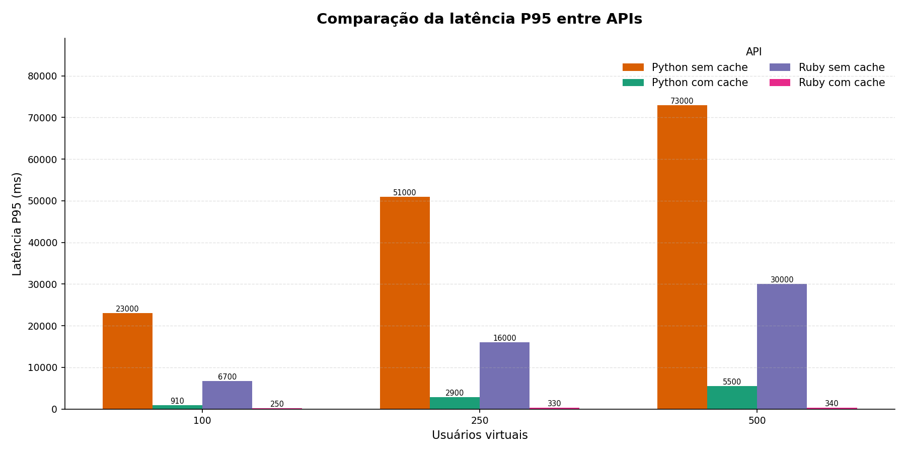
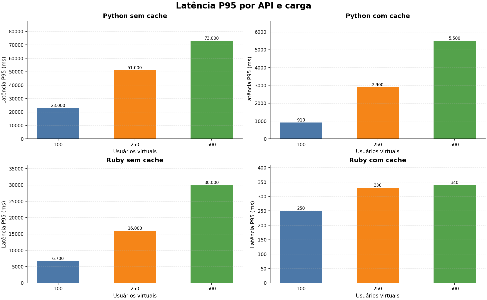
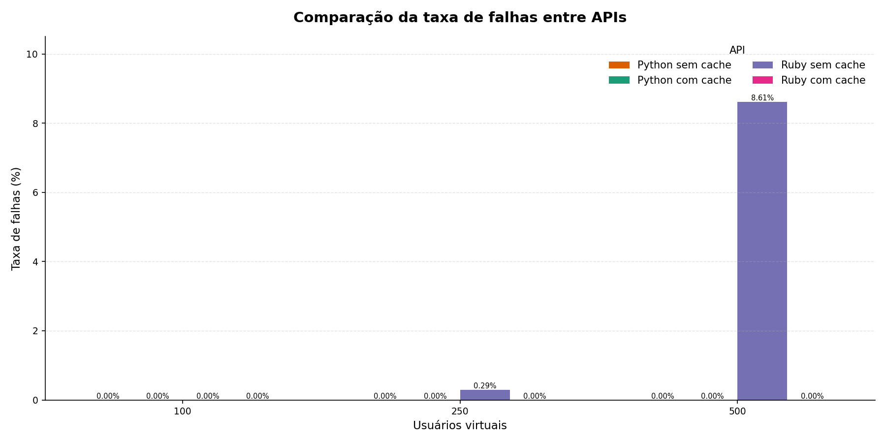
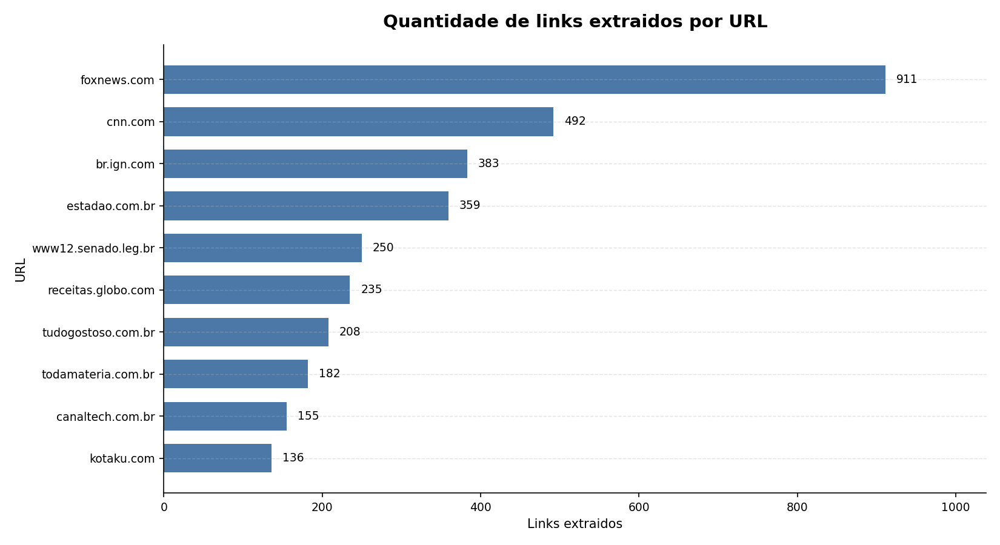

# Atividade 4 - Link Extractor

## Relatório do projeto

Este projeto apresenta a implementação e a avaliação experimental de desempenho da aplicação Link Extractor, utilizada como estudo prático de sistemas distribuídos. A aplicação recebe uma URL por meio de uma API HTTP, acessa a página correspondente, extrai os links presentes no documento HTML e retorna esses links em formato JSON.

O trabalho compara diferentes versões do serviço de extração, variando a linguagem de implementação e a presença de cache. A avaliação foi conduzida por meio de testes de carga automatizados com Locust, gerando arquivos CSV, planilhas consolidadas e gráficos para apoiar a análise.

## Objetivo

O objetivo principal foi medir como diferentes configurações do Link Extractor se comportam sob carga concorrente. Para isso, foram avaliados três aspectos:

- impacto da quantidade de usuários virtuais no tempo de resposta;
- diferença de comportamento entre as implementações em Python e Ruby;
- efeito do uso de cache Redis sobre desempenho e estabilidade.

Como resultado complementar, o experimento também registra quantos links foram extraídos de cada URL testada. Essa informação ajuda a caracterizar a carga de trabalho, pois páginas com mais links tendem a produzir respostas maiores e podem exigir mais processamento.

## Descrição da aplicação

O serviço exposto pela aplicação segue o formato:

```text
GET /api/<url>
```

Ao receber uma requisição, a API consulta a página remota informada, interpreta o HTML e retorna uma lista de objetos JSON com os links encontrados. Cada objeto representa um link extraído da página.

As versões sem cache executam a extração a cada requisição. Nas versões com cache, o resultado da primeira extração é armazenado no Redis e pode ser reutilizado em chamadas posteriores para a mesma URL. Isso reduz a necessidade de acessar novamente a página externa e de reprocessar seu HTML.

## Estrutura do projeto

| Pasta ou arquivo | Finalidade |
| --- | --- |
| `step4/` | Serviço Python sem cache, com API e interface web em containers |
| `step5/` | Serviço Python com cache Redis |
| `step6/` | Serviço Ruby com cache Redis |
| `step6-nocache/` | Serviço Ruby sem cache |
| `locust/locustfile.py` | Modelo de usuário virtual usado nos testes de carga |
| `scripts/run_all_benchmarks.ps1` | Execução automatizada dos testes no Windows/PowerShell |
| `scripts/run_all_benchmarks.sh` | Execução automatizada dos testes no Linux, WSL ou Git Bash |
| `scripts/consolidate_results.py` | Consolidação dos CSVs gerados pelo Locust |
| `scripts/generate_graphs.py` | Geração dos gráficos finais |
| `results/` | Resultados brutos de cada rodada de teste |
| `consolidated/` | CSV e XLSX consolidados |
| `graphs/` | Gráficos finais em PNG |

## Ferramentas utilizadas

Os testes de carga foram executados com Locust. Essa ferramenta permite modelar usuários virtuais em Python e medir automaticamente métricas como quantidade de requisições, falhas, tempos de resposta e throughput.

Também foram utilizadas as seguintes ferramentas e bibliotecas:

- Docker e Docker Compose, para iniciar os ambientes de teste;
- Redis, nos cenários com cache;
- Pandas, para consolidação dos resultados;
- Matplotlib, para geração dos gráficos;
- OpenPyXL, para exportação da planilha Excel consolidada.

As dependências Python do ambiente de análise estão listadas em `requirements.txt`.

## Carga de trabalho

Cada usuário virtual executa uma sequência de requisições para 10 URLs predefinidas. As URLs estão declaradas em `locust/locustfile.py` e representam páginas reais com diferentes tamanhos e quantidades de links.

O comportamento executado por cada usuário virtual é:

```text
1. requisitar /api/<url_1>
2. requisitar /api/<url_2>
3. continuar até /api/<url_10>
4. repetir a sequência enquanto durar o teste
```

Durante a execução, o Locust também interpreta a resposta JSON de cada URL e registra a quantidade de links extraídos. Ao final de cada rodada, essa contagem é salva em um CSV próprio.

## Cenários avaliados

Foram avaliadas quatro configurações principais:

| Cenário | Pasta | Host testado | Linguagem | Cache |
| --- | --- | --- | --- | --- |
| `python_nocache` | `step4` | `http://localhost:5000` | Python | sem cache |
| `python_cache` | `step5` | `http://localhost:5000` | Python | com Redis |
| `ruby_nocache` | `step6-nocache` | `http://localhost:4567` | Ruby | sem cache |
| `ruby_cache` | `step6` | `http://localhost:4567` | Ruby | com Redis |

Para cada cenário, o teste é repetido com diferentes quantidades de usuários virtuais. No script PowerShell, usado para os resultados consolidados deste repositório, são utilizados 25, 75 e 125 usuários.

Nos cenários com cache, o script aquece previamente o Redis antes do início das medições. Esse aquecimento consiste em executar uma chamada para cada uma das 10 URLs. Assim, os resultados com cache representam majoritariamente o comportamento de consultas já armazenadas, evitando misturar misses iniciais com hits durante a medição principal.

## Ambiente de execução

Os testes foram executados em uma máquina com as seguintes especificações:

| Componente | Especificação |
| --- | --- |
| Sistema operacional | Windows 11 |
| Processador | Intel Core 5 210H |
| Memória RAM | 24 GB DDR5 5600 MHz |
| Armazenamento | SSD de 1 TB |

## Procedimento experimental

O procedimento automatizado segue as seguintes etapas:

1. encerrar containers de cenários anteriores;
2. iniciar a composição Docker do cenário atual;
3. aguardar até que o serviço HTTP esteja disponível;
4. aquecer o Redis, quando o cenário possui cache;
5. executar o Locust em modo headless para cada quantidade de usuários;
6. salvar os CSVs e o relatório HTML de cada rodada em `results/`;
7. consolidar as métricas em `consolidated/resultados_consolidados.csv`;
8. exportar uma planilha em `consolidated/resultados_consolidados.xlsx`;
9. consolidar as contagens de links em `consolidated/links_extraidos_por_url.csv`;
10. gerar os gráficos finais em `graphs/`.

## Como executar

Antes de executar os testes, é necessário ter Docker, Docker Compose e Python disponíveis no ambiente.

Instale as dependências Python:

```powershell
pip install -r requirements.txt
```

No Windows/PowerShell:

```powershell
.\scripts\run_all_benchmarks.ps1
```

No Linux, WSL ou Git Bash:

```bash
bash scripts/run_all_benchmarks.sh
```

Ao final da execução, os principais artefatos estarão nas pastas `results/`, `consolidated/` e `graphs/`.

### Possível erro do Docker BuildKit

Durante a execução do cenário `ruby_nocache`, pode ocorrer uma falha semelhante a:

```text
failed to prepare extraction snapshot "...": parent snapshot ... does not exist: not found
```

Esse erro normalmente não indica problema no código Ruby nem no `Dockerfile`. Ele costuma estar relacionado a um estado inconsistente ou transitório do cache/snapshot interno do Docker BuildKit durante a etapa de exportação da imagem.

Para validar o cenário isoladamente, execute:

```powershell
cd step6-nocache
docker compose build api
docker compose up -d --build api
Invoke-WebRequest -Uri http://localhost:4567/api/https://example.com -UseBasicParsing -TimeoutSec 20
docker compose down --remove-orphans
```

Se o mesmo erro voltar, limpe apenas o cache de build do Docker e reconstrua o serviço:

```powershell
docker builder prune -f
docker compose up -d --build api
```

O aviso sobre o atributo `version` no `docker-compose.yml` é emitido por versões recentes do Docker Compose e não é a causa dessa falha.

## Métricas coletadas

O arquivo `consolidated/resultados_consolidados.csv` contém as principais métricas de desempenho:

| Coluna | Significado |
| --- | --- |
| `scenario` | Nome do cenário testado |
| `language` | Linguagem da implementação avaliada |
| `cache` | Indica se o cenário usa cache |
| `users` | Quantidade de usuários virtuais |
| `requests` | Total de requisições executadas |
| `failures` | Total de requisições com falha |
| `failure_rate_percent` | Percentual de falhas em relação ao total de requisições |
| `median_response_ms` | Mediana do tempo de resposta |
| `average_response_ms` | Média do tempo de resposta |
| `min_response_ms` | Menor tempo de resposta observado |
| `max_response_ms` | Maior tempo de resposta observado |
| `p95_response_ms` | Percentil 95 do tempo de resposta |
| `p99_response_ms` | Percentil 99 do tempo de resposta |
| `rps` | Requisições por segundo |
| `failures_s` | Falhas por segundo |

A taxa de falhas é calculada pela fórmula:

```text
failure_rate_percent = (failures / requests) * 100
```

O arquivo `consolidated/links_extraidos_por_url.csv` contém a caracterização da carga por URL:

| Coluna | Significado |
| --- | --- |
| `scenario` | Nome do cenário testado |
| `language` | Linguagem da implementação |
| `cache` | Modo de cache |
| `users` | Quantidade de usuários virtuais da rodada |
| `url` | URL utilizada na extração |
| `extracted_links` | Quantidade de links retornados pela API para aquela URL |

## Gráficos gerados

A versão atual do relatório gráfico exibe apenas as métricas mais relevantes para a comparação final:

- `graphs/line_p95.png`: evolução do P95 conforme aumenta a quantidade de usuários;
- `graphs/bar_p95.png`: comparação do P95 entre cenários e cargas;
- `graphs/latencia_por_api.png`: latência P95 de cada API separadamente, exibindo as três cargas testadas;
- `graphs/links_extraidos_por_url.png`: ranking das URLs pela quantidade de links extraídos;
- `graphs/line_taxa_falhas.png`: evolução da taxa de falhas em porcentagem;
- `graphs/bar_taxa_falhas.png`: comparação da taxa de falhas entre cenários e cargas.

O P95 foi escolhido porque representa um comportamento de cauda mais adequado que a média para observar degradação percebida por usuários. A taxa de falhas em porcentagem facilita a comparação entre rodadas com quantidades diferentes de requisições.

## Análise dos resultados consolidados

Os resultados presentes em `consolidated/resultados_consolidados.csv` mostram diferenças claras entre os cenários com e sem cache. A comparação principal foi feita a partir do P95, pois ele representa melhor a experiência dos usuários que ficaram na parte mais lenta da distribuição de respostas.



No gráfico de P95, a diferença entre usar ou não cache aparece de forma direta. No cenário `python_nocache`, o P95 foi de `23.000 ms` com 100 usuários, subiu para `51.000 ms` com 250 usuários e chegou a `73.000 ms` com 500 usuários. Com cache, o mesmo serviço Python ficou em `910 ms`, `2.900 ms` e `5.500 ms`, respectivamente. Isso representa reduções de aproximadamente `96,04%`, `94,31%` e `92,47%` no P95 em relação ao Python sem cache.

No caso do Ruby, o efeito do cache foi ainda mais forte. O cenário `ruby_nocache` apresentou P95 de `6.700 ms`, `16.000 ms` e `30.000 ms` para 100, 250 e 500 usuários. Já o `ruby_cache` ficou em `250 ms`, `330 ms` e `340 ms`. As reduções aproximadas foram de `96,27%`, `97,94%` e `98,87%`. Isso indica que, quando a resposta já está armazenada, a API deixa de depender da latência da página externa e passa a responder quase sempre a partir do Redis.



O gráfico separado por API reforça o comportamento de escalabilidade de cada cenário. O `ruby_cache` manteve a latência mais estável, variando apenas de `250 ms` para `340 ms` no P95 entre 100 e 500 usuários. O `python_cache` também se beneficiou do cache, mas sua latência cresceu mais com a carga: de `910 ms` para `5.500 ms`. Nos cenários sem cache, a degradação foi bem mais acentuada: o Python sem cache aumentou de `23.000 ms` para `73.000 ms`, enquanto o Ruby sem cache passou de `6.700 ms` para `30.000 ms`.

Além da latência, o throughput confirma a diferença de comportamento. O `python_cache` processou `380,79`, `369,63` e `369,42` requisições por segundo nas três cargas, enquanto o `python_nocache` ficou em `10,94`, `8,13` e `5,35` requisições por segundo. Em termos relativos, o cache tornou o throughput do Python cerca de `34,80x`, `45,47x` e `69,04x` maior. No Ruby, o `ruby_cache` atingiu `679,30`, `785,80` e `778,03` requisições por segundo, contra `21,19`, `19,99` e `18,33` no `ruby_nocache`, uma diferença de aproximadamente `32,06x`, `39,32x` e `42,46x`.



Na taxa de falhas, os cenários com cache foram os mais estáveis: `python_cache` e `ruby_cache` tiveram `0` falhas em todas as cargas, ou seja, `0,00%`. O `python_nocache` também registrou `0,00%` de falhas, mas executou um volume muito menor de requisições: `1.299`, `974` e `634` nas três rodadas, mostrando que a ausência de falhas não significou bom desempenho.

O ponto de atenção aparece no `ruby_nocache`. Com 100 usuários, ele teve `0` falhas em `2.517` requisições, ficando em `0,00%`. Com 250 usuários, registrou `7` falhas em `2.376` requisições, taxa de `0,29%`. Com 500 usuários, chegou a `189` falhas em `2.195` requisições, taxa de `8,61%`. Esse aumento mostra que, sem cache, a API passa a sofrer mais com concorrência, dependência de rede e tempo de processamento das páginas externas.



A carga de trabalho também não foi uniforme entre as URLs testadas. A página com maior quantidade de links foi `www.foxnews.com`, com até `911` links extraídos. Em seguida aparecem `cnn.com`, com `492`, `br.ign.com`, com `383`, e `www.estadao.com.br`, com `359`. No outro extremo, `kotaku.com` teve `136` links e `canaltech.com.br` teve `155`. Essa diferença ajuda a explicar parte da variação de tempo nos cenários sem cache: páginas maiores tendem a gerar respostas maiores e exigem mais processamento de HTML a cada requisição.

De forma geral, os gráficos mostram que o cache foi o principal fator de melhoria do experimento. Ele reduziu drasticamente a latência P95, aumentou o volume de requisições por segundo e eliminou as falhas nos cenários avaliados. A comparação também mostra que o desempenho não depende apenas da linguagem usada, mas principalmente da arquitetura da solução: quando a API precisa buscar e processar páginas externas a cada chamada, o sistema degrada rapidamente; quando reutiliza respostas em cache, ele suporta cargas maiores com mais estabilidade.

## Considerações finais

O experimento permitiu observar, de maneira prática, como escolhas arquiteturais afetam o desempenho de um serviço distribuído. A comparação entre implementações e modos de cache evidencia que o desempenho não depende apenas da linguagem utilizada, mas também da dependência de rede, do reuso de resultados e da forma como o sistema responde ao aumento da concorrência.

Como continuidade, seria possível ampliar a avaliação com mais níveis de carga, maior tempo de execução, repetições estatísticas por cenário e coleta de métricas de CPU, memória e uso de rede dos containers.
