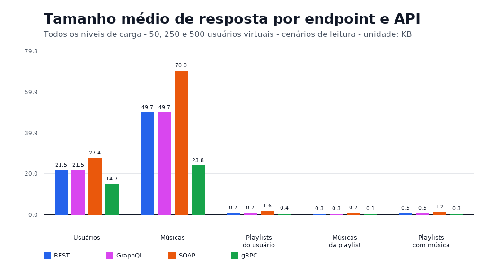
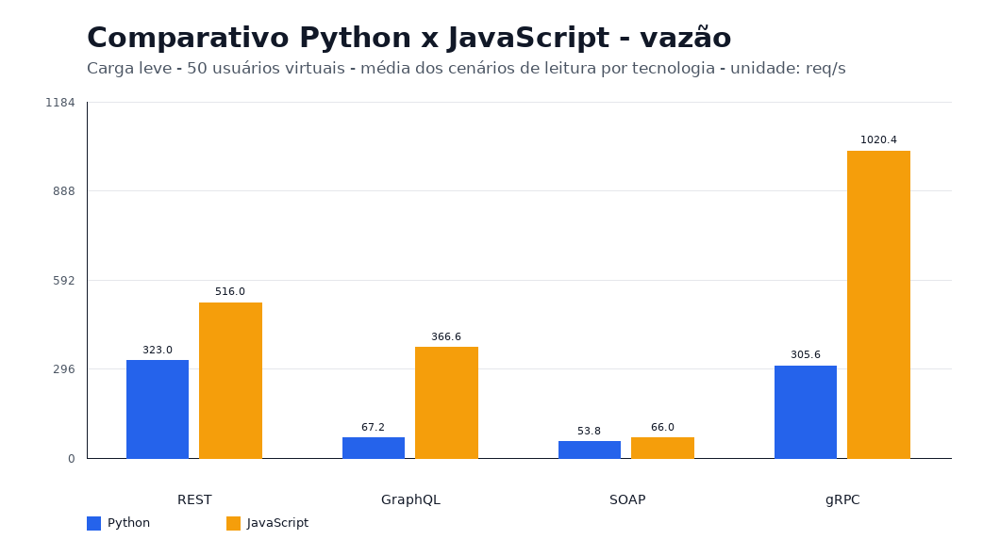
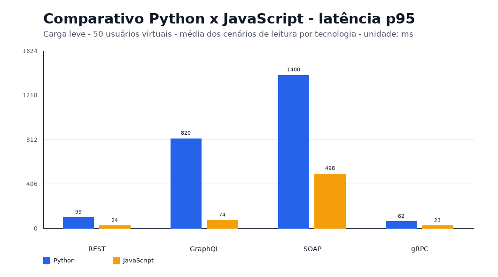
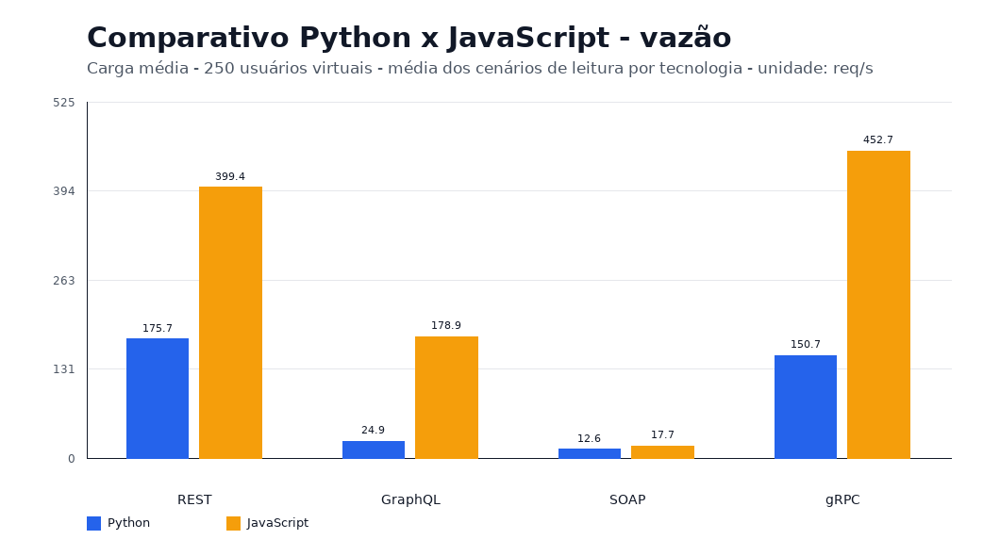
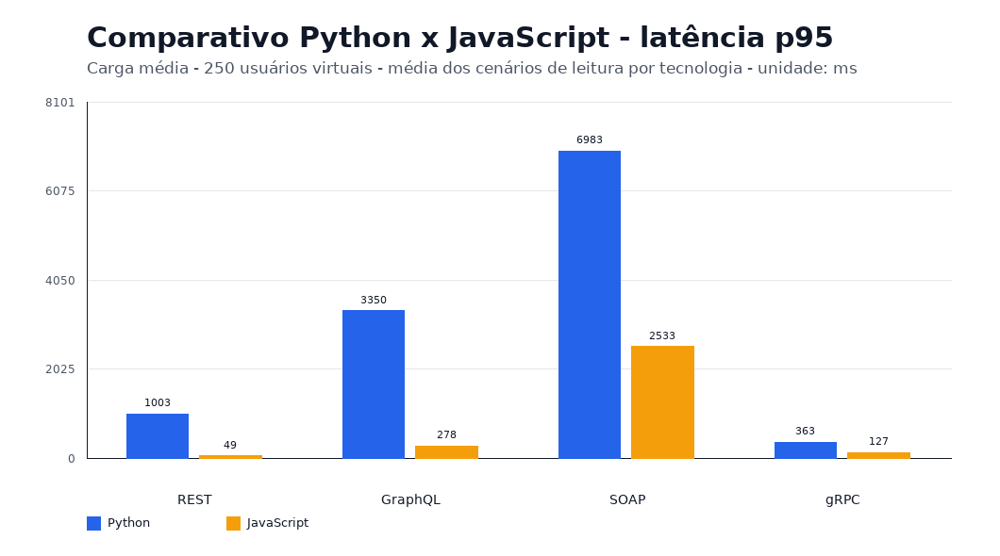
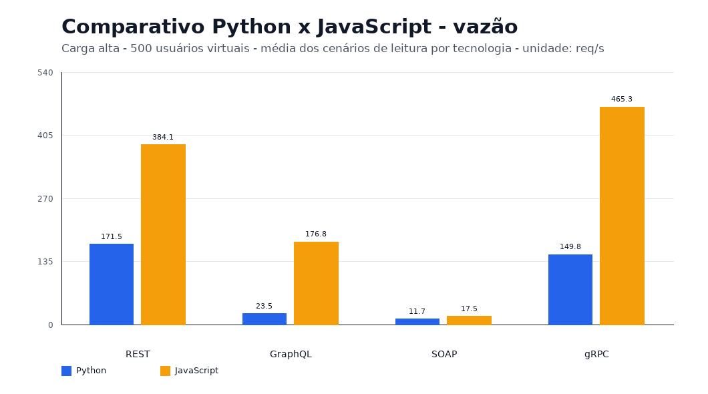
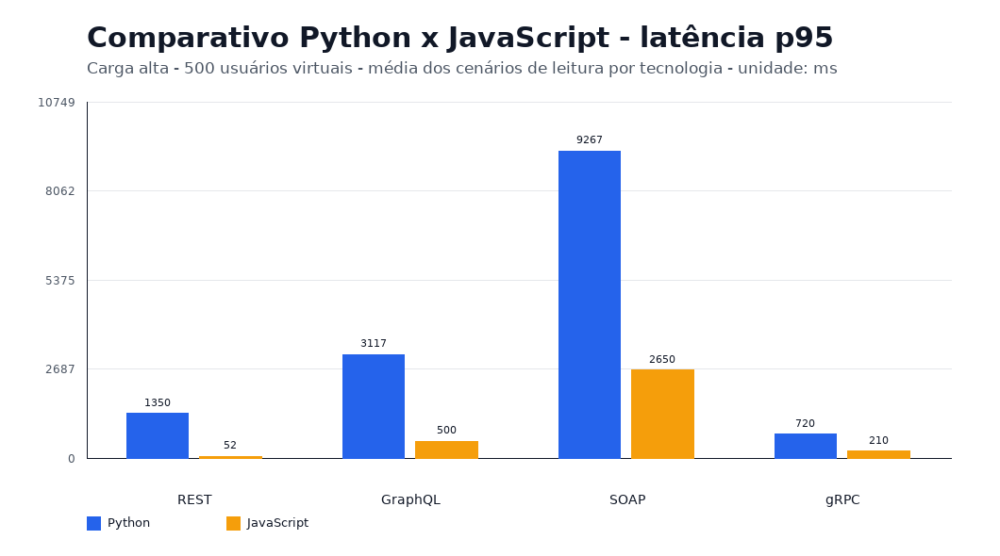

# Trabalho 6 - Comparação de Tecnologias de Invocação de Serviços Remotos

Projeto com implementações em Python e JavaScript/Node.js para comparar SOAP, REST, GraphQL e gRPC usando o mesmo serviço de streaming de músicas. A comparação é feita com Locust, três cargas de usuários virtuais e gráficos gerados automaticamente a partir dos resultados.

Detalhes específicos da versão JavaScript ficam em `services/javascript/README.md`.

## Equipe

- João Victor da Silva Ferreira - 2314387
- Paulo Marconi Araújo Tomaz da Silva - 2310435

## Ambiente de execução

Os testes foram executados em uma máquina com as seguintes especificações:

| Componente          | Especificação       |
| ------------------- | ------------------- |
| Sistema operacional | Windows 11          |
| Processador         | Intel Core 5 210H   |
| Memória RAM         | 24 GB DDR5 5200 MHz |
| Armazenamento       | SSD de 1 TB         |

## Objetivo

O objetivo é comparar tecnologias de invocação remota em um mesmo domínio. Para manter a comparação justa, as quatro APIs de cada linguagem usam a mesma regra de negócio e a mesma base de dados em memória.

O serviço gerencia:

- Usuários.
- Músicas.
- Playlists.

A base inicial fica inteiramente em memória e já nasce com uma massa maior para os testes de carga:

| Entidade  | Quantidade inicial |
| --------- | -----------------: |
| Usuários  |                300 |
| Músicas   |                500 |
| Playlists |                400 |

Operações cobertas:

- Criar, consultar, alterar e remover usuários.
- Criar, consultar, alterar e remover músicas.
- Criar, consultar, alterar e remover playlists.
- Listar todas as playlists.
- Listar playlists de um usuário.
- Listar músicas de uma playlist.
- Listar playlists que contêm uma música.

## Tecnologias Comparadas

REST:

- Implementado com HTTP minimalista nas duas linguagens: `http.server` em Python e `node:http` em JavaScript.
- Usa URLs, JSON e métodos HTTP.
- Portas locais: `3000` em Python e `3100` em JavaScript.

GraphQL:

- Implementado com `graphql-core` e `http.server` na versão Python; na versão JavaScript, com a biblioteca `graphql` e `node:http`.
- Usa schema tipado e permite consultar exatamente os campos desejados.
- Endpoints locais: `http://localhost:3001/graphql` em Python e `http://localhost:3101/graphql` em JavaScript.

SOAP:

- Implementado com HTTP minimalista e XML nas duas linguagens: `http.server` em Python e `node:http` em JavaScript.
- Expõe endpoint SOAP, WSDL e validações adicionais de envelope, namespace, operação e campos.
- O custo extra de processamento XML pode ser ajustado com `SOAP_COMPLEXITY_PASSES`.
- Endpoints locais: `http://localhost:3002/soap` em Python e `http://localhost:3102/soap` em JavaScript.

gRPC:

- Implementado com `grpcio` em Python e com `@grpc/grpc-js` na versão JavaScript.
- Usa o contrato `proto/music.proto`.
- O Python usa código protobuf/gRPC gerado por `grpcio-tools`.
- O JavaScript usa `@grpc/proto-loader` para carregar o contrato `.proto` e delegar a serialização para a biblioteca gRPC.
- Portas locais: `50051` em Python e `55051` em JavaScript.

## Características de cada API

O projeto tem implementações em Python e JavaScript. Os exemplos conceituais abaixo usam Python por simplicidade, e a versão JavaScript fica organizada em `services/javascript/`.

### REST

REST, ou Representational State Transfer, foi formalizado por Roy Fielding em sua tese de doutorado em 2000. Ele não é um protocolo fechado, mas um estilo arquitetural para construção de sistemas distribuídos usando recursos, identificadores e operações padronizadas.

Características:

- Usa recursos identificados por URLs.
- Normalmente usa HTTP, JSON e métodos como `GET`, `POST`, `PUT`, `PATCH` e `DELETE`.
- É stateless, ou seja, cada requisição deve conter as informações necessárias para ser processada.
- É muito usado em APIs web e aplicações CRUD.

Vantagens:

- Simples de entender, testar e integrar.
- Compatível com navegadores, ferramentas HTTP e praticamente qualquer linguagem.
- Boa escolha para APIs públicas e serviços com operações bem definidas.

Desvantagens:

- Pode gerar excesso ou falta de dados em algumas consultas.
- Não possui contrato fortemente tipado por padrão.
- Pode exigir várias requisições para montar telas ou respostas mais relacionais.

Exemplo em Python:

```python
import requests

base_url = "http://localhost:3000"

response = requests.get(f"{base_url}/songs", timeout=5)
response.raise_for_status()

songs = response.json()
print(songs)
```

### GraphQL

GraphQL foi criado pelo Facebook em 2012 e disponibilizado publicamente em 2015. Ele surgiu para resolver problemas comuns em APIs REST usadas por aplicações móveis e web, principalmente o excesso de chamadas e o retorno de dados desnecessários.

Características:

- Usa um schema tipado.
- A API normalmente expõe um único endpoint.
- O cliente define quais campos deseja receber.
- Suporta consultas, mutações e composição de dados relacionados.

Vantagens:

- Reduz overfetching, quando a API retorna mais dados do que o necessário.
- Reduz underfetching, quando o cliente precisa fazer várias chamadas para montar uma resposta.
- Facilita a evolução da API por meio do schema.

Desvantagens:

- Possui maior complexidade de implementação.
- Consultas mal controladas podem ser custosas para o servidor.
- Cache HTTP tradicional tende a ser menos direto do que em REST.

Exemplo em Python:

```python
import requests

query = """
query {
  songs {
    id
    title
    artist
  }
}
"""

response = requests.post(
    "http://localhost:3001/graphql",
    json={"query": query},
    timeout=5,
)
response.raise_for_status()

payload = response.json()
print(payload["data"]["songs"])
```

### SOAP

SOAP, ou Simple Object Access Protocol, surgiu no fim da década de 1990 e foi padronizado pelo W3C. Ele foi muito usado em ambientes corporativos por oferecer uma forma mais formal de integração entre sistemas, baseada em XML e contratos.

Características:

- Usa mensagens XML estruturadas em envelopes SOAP.
- Pode ser descrito por WSDL.
- Costuma ser usado sobre HTTP, mas não depende exclusivamente dele.
- Tem forte presença em integrações corporativas e sistemas legados.

Vantagens:

- Possui contrato formal por WSDL.
- É adequado para cenários corporativos que exigem padronização rígida.
- Conta com padrões adicionais para segurança, transações e confiabilidade.

Desvantagens:

- É mais verboso por usar XML.
- Pode ser mais difícil de ler, testar e depurar manualmente.
- Em muitos cenários modernos, é mais pesado do que REST ou gRPC.

Exemplo em Python:

```python
import requests

envelope = """
<soap:Envelope xmlns:soap="http://schemas.xmlsoap.org/soap/envelope/">
  <soap:Body>
    <ListPlaylistSongs>
      <playlistId>p1</playlistId>
    </ListPlaylistSongs>
  </soap:Body>
</soap:Envelope>
"""

response = requests.post(
    "http://localhost:3002/soap",
    data=envelope.encode("utf-8"),
    headers={"Content-Type": "text/xml; charset=utf-8"},
    timeout=5,
)
response.raise_for_status()

print(response.text)
```

### gRPC

gRPC foi criado pelo Google e lançado publicamente em 2015, inspirado em uma tecnologia interna chamada Stubby. Ele usa HTTP/2 e Protocol Buffers para comunicação eficiente entre serviços.

Características:

- Usa arquivos `.proto` para definir serviços e mensagens.
- Usa Protocol Buffers como formato binário de serialização.
- Suporta chamadas unary, streaming do cliente, streaming do servidor e streaming bidirecional.
- É muito usado em comunicação entre microsserviços.

Vantagens:

- Alto desempenho e menor payload em comparação com formatos textuais.
- Contrato fortemente tipado pelo arquivo `.proto`.
- Bom suporte para geração de clientes em várias linguagens.

Desvantagens:

- É menos simples de testar diretamente pelo navegador.
- Exige ferramentas e clientes compatíveis com gRPC.
- Pode ser mais complexo para APIs públicas consumidas por clientes variados.

Exemplo em Python:

```python
import grpc

from music_service.generated import music_pb2, music_pb2_grpc

channel = grpc.insecure_channel("localhost:50051")

try:
    client = music_pb2_grpc.MusicStreamingStub(channel)
    response = client.ListSongs(music_pb2.Empty(), timeout=5)
    print(response.songs)
finally:
    channel.close()
```

No gRPC, o contrato em `proto/music.proto` é a fonte principal das mensagens e operações. A versão Python usa módulos gerados a partir desse contrato, enquanto a versão JavaScript carrega o mesmo arquivo `.proto` com a biblioteca oficial de gRPC para Node.js. Assim, a serialização Protocol Buffers fica sob responsabilidade das bibliotecas, não de código manual do projeto.

## Metodologia

O domínio compartilhado fica em:

```text
services/python/music_service/domain/music_store.py
```

Na versão JavaScript, a regra equivalente fica em:

```text
services/javascript/domain/musicStore.js
```

Esses módulos contêm:

- dados iniciais;
- validações;
- regras de criação, alteração, remoção e consulta;
- relações entre usuários, músicas e playlists.

Os servidores apenas adaptam suas chamadas para esse mesmo domínio em cada linguagem. Assim, a diferença entre REST, GraphQL, SOAP e gRPC fica concentrada no mecanismo de invocação remota, não na regra de negócio.

Os dados iniciais são gerados de forma determinística no código das duas linguagens. Não há banco de dados nem arquivo externo; ao reiniciar ou chamar `reset`, cada serviço volta para a mesma massa em memória com centenas de registros.

## Equivalência das Implementações

As implementações em Python e JavaScript são equivalentes em comportamento para o escopo do trabalho. As duas linguagens expõem as mesmas entidades, as mesmas operações de CRUD e os mesmos cenários de leitura em REST, GraphQL, SOAP e gRPC.

Foram mantidos os mesmos dados iniciais, as mesmas regras de validação e as mesmas relações entre usuários, músicas e playlists. Dessa forma, os testes de carga comparam principalmente o mecanismo de comunicação remota, a serialização e o servidor usado em cada linguagem, não diferenças na regra de negócio.

As APIs HTTP usam servidores minimalistas nas duas linguagens para reduzir diferenças de framework. O SOAP inclui validações e reprocessamento de XML para representar melhor o custo típico desse modelo. O gRPC usa a toolchain de Protocol Buffers em vez de serialização manual.

## Estrutura

```text
.
|-- docker-compose.yml
|-- locustfile.py
|-- proto/
|   `-- music.proto
|-- services/
|   |-- python/
|   |   |-- Dockerfile
|   |   |-- requirements.txt
|   |   `-- music_service/
|   |       |-- generated/
|   |       |-- http_utils.py
|   |       `-- servers/
|   `-- javascript/
|       |-- Dockerfile
|       |-- package.json
|       |-- domain/
|       `-- servers/
|-- scripts/
|   |-- run_python.ps1
|   |-- run_javascript.ps1
|   |-- run_all.ps1
|   |-- start_services/
|   |-- run_locust_scenarios.py
|   `-- generate_charts.py
`-- results/
```

Arquivos importantes:

- `services/python/Dockerfile`: imagem Python usada pelos servidores Python, Locust e gráficos.
- `services/javascript/Dockerfile`: imagem Node.js usada pelos servidores JavaScript.
- `services/python/music_service/generated/`: módulos protobuf/gRPC gerados a partir de `proto/music.proto`.
- `services/python/music_service/http_utils.py`: utilitário HTTP minimalista usado por REST, GraphQL e SOAP em Python.
- `docker-compose.yml`: sobe as APIs das duas linguagens, Locust, bateria de testes e geração de gráficos.
- `locustfile.py`: define os usuários virtuais e cenários de carga.
- `scripts/run_python.ps1`: executa apenas a implementação Python.
- `scripts/run_javascript.ps1`: executa apenas a implementação JavaScript.
- `scripts/run_all.ps1`: executa Python e JavaScript no mesmo comando.
- `scripts/start_services/`: scripts para subir uma API isolada, sem executar Locust.
- `scripts/start_services/README.md`: guia de endpoints CRUD e exemplos de requisições para REST, GraphQL, SOAP e gRPC.
- `scripts/run_locust_scenarios.py`: executa a bateria com 50, 250 e 500 usuários.
- `scripts/generate_charts.py`: gera gráficos PNG, resumo agregado e comparativo Python x JavaScript. Quando executado sem `LOCUST_RESULTS_DIR`, detecta automaticamente `results/python` e `results/javascript`, se existirem.

## Execução com PowerShell

Cada script sobe as APIs em containers, espera os serviços ficarem saudáveis, executa a bateria headless do Locust, gera os gráficos e encerra os containers ao final.

Rodar apenas Python:

```powershell
.\scripts\run_python.ps1
```

Rodar apenas JavaScript:

```powershell
.\scripts\run_javascript.ps1
```

Rodar uma API específica de uma linguagem:

```powershell
.\scripts\run_python.ps1 -Api rest
.\scripts\run_python.ps1 -Api graphql
.\scripts\run_python.ps1 -Api soap
.\scripts\run_python.ps1 -Api grpc

.\scripts\run_javascript.ps1 -Api rest
.\scripts\run_javascript.ps1 -Api graphql
.\scripts\run_javascript.ps1 -Api soap
.\scripts\run_javascript.ps1 -Api grpc
```

Subir uma API e deixá-la disponível para acesso posterior, sem executar Locust:

```powershell
.\scripts\run_python.ps1 -Api rest -StartOnly
.\scripts\run_javascript.ps1 -Api graphql -StartOnly
```

Também é possível usar os scripts específicos de `scripts/start_services/` para subir apenas um serviço:

```powershell
.\scripts\start_services\python_rest.ps1
.\scripts\start_services\python_graphql.ps1
.\scripts\start_services\python_soap.ps1
.\scripts\start_services\python_grpc.ps1

.\scripts\start_services\javascript_rest.ps1
.\scripts\start_services\javascript_graphql.ps1
.\scripts\start_services\javascript_soap.ps1
.\scripts\start_services\javascript_grpc.ps1
```

O guia completo de endpoints CRUD e exemplos de requisição está em `scripts/start_services/README.md`.

## Bateria de Testes

Os testes usam três cargas:

| Cenário       | Usuários virtuais |
| ------------- | ----------------: |
| `carga-leve`  |                50 |
| `carga-media` |               250 |
| `carga-alta`  |               500 |

O `spawn-rate` é único para os três cenários. Nos scripts PowerShell, o padrão é `10` usuários por segundo; ao executar o serviço do Locust diretamente pelo Docker Compose sem definir variável de ambiente, o Compose usa `100`.

O script `run_all.ps1` já roda a bateria completa. Caso queira executar manualmente pelo Docker Compose:

```powershell
docker compose up -d rest-python graphql-python soap-python grpc-python
docker compose --profile python-scenarios run --rm locust-python
```

Para filtrar a bateria para uma tecnologia ao executar o runner diretamente, use `LOCUST_TECHNOLOGIES` com `rest`, `graphql`, `soap` ou `grpc`.

Os resultados são salvos em:

```text
results/python/
results/javascript/
```

Quando `-Api` é usado, os resultados ficam em subpastas por tecnologia, por exemplo `results/python/rest/` ou `results/javascript/graphql/`.

## Cenários do Locust

Cada tecnologia executa os mesmos cenários de leitura geral:

- `listar-usuarios`: lista os dados de todos os usuários do serviço.
- `listar-musicas`: lista os dados de todas as músicas mantidas pelo serviço.
- `listar-playlists`: lista os dados de todas as playlists mantidas pelo serviço.
- `listar-playlists-usuario`: lista os dados de todas as playlists de um determinado usuário.
- `listar-musicas-playlist`: lista os dados de todas as músicas de uma determinada playlist.
- `listar-playlists-musica`: lista os dados de todas as playlists que contêm uma determinada música.

O CRUD completo continua disponível nas APIs para uso manual, mas a bateria do Locust usa apenas essas consultas de leitura para forçar respostas maiores com a massa em memória. Nessa massa, o usuário `u1` possui 300 playlists, a playlist `p1` possui 300 músicas e a música `s1` aparece em 300 playlists.

O `locustfile.py` não define pausas artificiais entre tarefas. Os usuários virtuais executam chamadas continuamente durante o tempo do teste.

## Métricas

As principais métricas são:

- vazão em requisições por segundo;
- latência média;
- latência p95;
- tamanho médio da resposta.

## Gráficos

Todos os arquivos PNG são gravados diretamente em uma única pasta:

```text
results/charts/
```

Os nomes dos arquivos indicam a linguagem e a carga, por exemplo `python-locust-throughput-carga-leve-u50.png`, `javascript-locust-p95-latency-carga-alta-u500.png` e `comparativo-locust-throughput-carga-media-u250.png`.

São gerados quatro gráficos para cada carga. Dois gráficos agregam os seis cenários de leitura e mostram a média por tecnologia:

- vazão média;
- latência p95 média.

Os outros dois gráficos mantêm a visão detalhada por cenário de leitura, como usuários, músicas, playlists, playlists do usuário, músicas da playlist e playlists que contêm uma música:

- vazão por tecnologia e cenário de leitura;
- latência p95 por tecnologia e cenário de leitura.

Quando os resultados das duas linguagens existem, também são gerados quatro gráficos comparativos por carga. Dois usam as mesmas médias e barras verticais agrupadas por tecnologia, comparando pares como `REST Python` x `REST JavaScript`. Os outros dois detalham os cenários de leitura.

Como o tamanho da resposta depende do endpoint e da tecnologia, mas não do número de usuários virtuais, essa métrica é mostrada em um gráfico próprio, consolidado entre as cargas disponíveis:

- tamanho médio geral por endpoint e API.

## Análise e Discussão dos Resultados

A análise abaixo usa os gráficos comparativos gerados em `results/charts/`. Em todos os casos, a vazão está em requisições por segundo, então valores maiores são melhores; a latência usa p95 em milissegundos, então valores menores são melhores; e o tamanho médio da resposta está em KB por requisição. Os números de vazão e latência apresentados são a média dos seis cenários de leitura do Locust: listar usuários, listar músicas, listar playlists, listar playlists do usuário, listar músicas da playlist e listar playlists que contêm uma música.

### Tamanho médio por endpoint

O gráfico abaixo consolida as cargas de 50, 250 e 500 usuários e também consolida as duas linguagens, porque o volume retornado por cada endpoint não muda quando há mais usuários simultâneos. Ele serve para comparar quanto cada API retorna em cada cenário de leitura.



O resultado mostra que `listar-musicas`, `listar-playlists` e `listar-usuarios` retornam coleções completas da base em memória, enquanto `listar-playlists-usuario`, `listar-musicas-playlist` e `listar-playlists-musica` retornam coleções filtradas com 300 itens. Esses cenários filtrados têm peso relevante nas médias finais de latência e vazão.

As diferenças entre APIs vêm principalmente do formato de serialização. REST e GraphQL usam JSON textual e ficam muito próximos em tamanho; GraphQL adiciona uma estrutura de resposta própria, mas o peso dominante ainda são os objetos retornados. SOAP é o maior payload por causa do envelope XML, namespaces e tags repetidas. gRPC é o menor porque usa Protocol Buffers em formato binário: por exemplo, na média geral, `listar-musicas` fica em aproximadamente 49,7 KB no REST/GraphQL, 70,0 KB no SOAP e 23,8 KB no gRPC. Essa diferença de tamanho ajuda a explicar o desempenho de latência do gRPC em vários cenários.

### Carga leve: 50 usuários virtuais





| Tecnologia | Python req/s | JavaScript req/s | Python p95 | JavaScript p95 |
| ---------- | -----------: | ---------------: | ---------: | -------------: |
| REST       |       206,41 |           405,86 |      99 ms |          24 ms |
| GraphQL    |        26,64 |           176,15 |     820 ms |          74 ms |
| SOAP       |        13,93 |            17,57 |   1.400 ms |         498 ms |
| gRPC       |       150,68 |           453,49 |      62 ms |          23 ms |

Com 50 usuários, o JavaScript mostra o comportamento esperado para gRPC em vazão: 453,49 req/s contra 405,86 req/s do REST. A latência p95 também fica praticamente empatada, com pequena vantagem para o gRPC: 23 ms contra 24 ms. Isso indica que, em baixa concorrência, o custo extra da pilha gRPC é compensado pelo payload binário menor e pelo uso de HTTP/2.

No Python, a leitura é mais sutil. O REST ainda conclui mais requisições por segundo, com 206,41 req/s contra 150,68 req/s do gRPC. Porém, em latência p95, o gRPC é melhor: 62 ms contra 99 ms. Ou seja, o REST Python tem maior vazão média, mas o gRPC entrega uma cauda de latência menor para a maior parte dos endpoints.

GraphQL e SOAP já aparecem como os caminhos mais pesados. GraphQL Python fica em apenas 26,64 req/s e p95 de 820 ms, muito distante da versão JavaScript. SOAP é o mais lento nas duas linguagens, principalmente pelo custo de XML e validação.

### Carga média: 250 usuários virtuais





| Tecnologia | Python req/s | JavaScript req/s | Python p95 | JavaScript p95 |
| ---------- | -----------: | ---------------: | ---------: | -------------: |
| REST       |       175,69 |           399,37 |   1.003 ms |          49 ms |
| GraphQL    |        24,86 |           178,93 |   3.350 ms |         278 ms |
| SOAP       |        12,61 |            17,70 |   6.983 ms |       2.533 ms |
| gRPC       |       150,73 |           452,71 |     363 ms |         127 ms |

Com 250 usuários, o efeito da concorrência fica claro. No Python, REST ainda tem maior vazão que gRPC, mas a latência p95 sobe para 1.003 ms. O gRPC mantém praticamente a mesma vazão da carga leve, 150,73 req/s, mas com p95 de 363 ms. Assim, mesmo processando menos requisições por segundo que REST, o gRPC Python responde com menor latência de cauda sob carga média.

No JavaScript, o gRPC passa o REST com folga em vazão: 452,71 req/s contra 399,37 req/s. Porém, a latência p95 do gRPC sobe para 127 ms, enquanto o REST fica em 49 ms. Isso mostra que, nessa implementação Node.js, o gRPC prioriza maior volume concluído por segundo, mas acumula mais tempo de espera na cauda quando a concorrência aumenta.

GraphQL Python e SOAP Python entram em saturação forte. A vazão quase não cresce com mais usuários, e a latência sobe muito. O mesmo padrão aparece no SOAP JavaScript, que mantém vazão perto de 17 req/s e p95 acima de 2,5 s.

### Carga alta: 500 usuários virtuais





| Tecnologia | Python req/s | JavaScript req/s | Python p95 | JavaScript p95 |
| ---------- | -----------: | ---------------: | ---------: | -------------: |
| REST       |       171,51 |           384,15 |   1.350 ms |          52 ms |
| GraphQL    |        23,51 |           176,76 |   3.117 ms |         500 ms |
| SOAP       |        11,66 |            17,47 |   9.267 ms |       2.650 ms |
| gRPC       |       149,78 |           465,30 |     720 ms |         210 ms |

Com 500 usuários, o gRPC se confirma como melhor opção de latência no Python entre REST e gRPC. O REST ainda tem mais vazão, 171,51 req/s contra 149,78 req/s, mas seu p95 chega a 1.350 ms. O gRPC fica em 720 ms, quase metade da latência p95 do REST. Esse resultado combina com a redução de payload e com a serialização binária, que passam a pesar mais quando cada endpoint retorna centenas de objetos.

No JavaScript, o gRPC é a melhor tecnologia em vazão: 465,30 req/s, acima do REST com 384,15 req/s. Ainda assim, o REST mantém a menor latência p95 entre as APIs JavaScript principais, com 52 ms contra 210 ms do gRPC. Portanto, em JavaScript, a conclusão depende da métrica: gRPC vence em volume de requisições por segundo, REST vence em latência de cauda na carga alta.

GraphQL continua intermediário no JavaScript e problemático no Python. SOAP permanece como a tecnologia mais cara em todos os cenários, com p95 muito alto, especialmente no Python, onde chega a 9.267 ms na carga alta.

#### gRPC x REST

Com os endpoints filtrados retornando 300 itens, o gRPC se destaca principalmente em latência no Python e em vazão no JavaScript.

No Python, o REST venceu o gRPC em vazão em todos os seis endpoints e nas três cargas. Porém, o gRPC venceu o REST em p95 em 17 das 18 combinações de endpoint e carga; a única exceção foi praticamente um empate em `listar-usuarios` com 50 usuários. Isso significa que o REST Python ainda processa mais requisições por segundo, mas o gRPC Python entrega respostas mais estáveis na cauda quando a carga cresce. Para uma análise de "rapidez" baseada em latência percebida, o gRPC ficou melhor na maior parte dos cenários Python.

No JavaScript, o gRPC venceu o REST em vazão em todas as 18 combinações de endpoint e carga. Em baixa carga, a latência p95 ficou empatada ou levemente melhor para o gRPC. Em 250 e 500 usuários, porém, o REST manteve p95 menor. Assim, no JavaScript, o gRPC é a melhor escolha para throughput, enquanto REST é mais previsível quando o critério principal é p95 sob alta concorrência.

Essa diferença mostra por que é importante analisar vazão e latência juntas. Uma tecnologia pode concluir mais requisições por segundo e, ao mesmo tempo, ter p95 maior se houver mais espera na cauda. Como as respostas têm centenas de itens, o menor payload do gRPC tem impacto direto na comparação.

## Conclusão

Nos resultados medidos, o gRPC é muito competitivo e supera REST em recortes importantes. No Python, o principal ganho do gRPC aparece na latência p95: mesmo com vazão menor que REST, ele respondeu mais rápido na cauda em quase todos os cenários. No JavaScript, o principal ganho aparece na vazão: gRPC foi a tecnologia com maior número de requisições por segundo nas três cargas, superando REST em todos os endpoints testados.

REST continua sendo uma opção muito forte. No Python, ele manteve a maior vazão entre REST e gRPC, embora com p95 pior quando a carga aumentou. No JavaScript, REST teve vazão menor que gRPC, mas apresentou latência p95 mais estável nas cargas média e alta. Isso reforça que REST é simples, direto e previsível, especialmente quando a implementação usa servidores HTTP minimalistas e JSON sem camadas extras.

GraphQL teve comportamento mais sensível ao runtime. No JavaScript, manteve vazão intermediária e latência aceitável em baixa carga, mas perdeu estabilidade conforme os usuários aumentaram. No Python, ficou muito limitado, porque cada requisição exige parsing da consulta, validação do schema, execução e resolução de campos em muitos objetos. SOAP foi a tecnologia mais pesada no conjunto geral, principalmente pelo XML, envelope, namespaces, validações e maior volume textual trafegado.

A conclusão prática é que não existe um vencedor único para todos os critérios. Se o foco for maior vazão entre serviços, gRPC foi a melhor escolha, principalmente no JavaScript. Se o foco for menor latência p95 no Python, gRPC também é mais vantajoso que REST nesta massa de dados. Se o foco for simplicidade e boa previsibilidade, REST continua muito competitivo. GraphQL é útil quando o cliente precisa controlar exatamente os campos retornados, mas cobra custo de execução. SOAP permanece adequado para contextos legados e formais, mas foi o mais caro para esse cenário de alto volume de chamadas.
